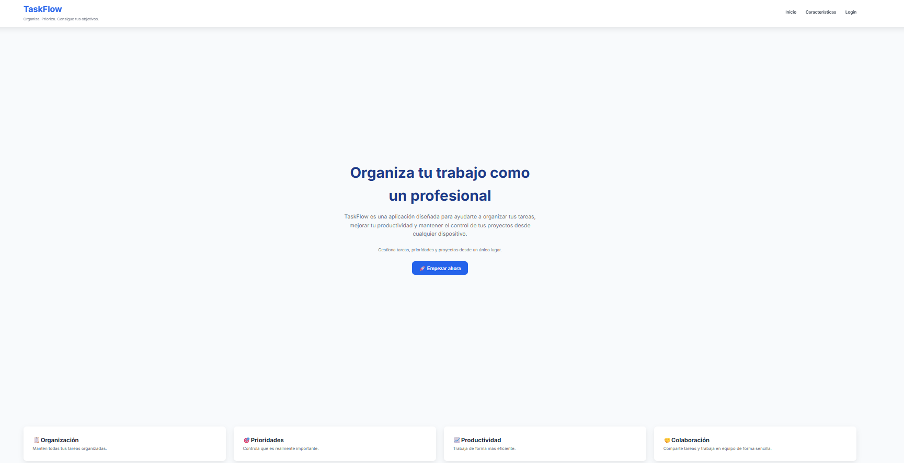
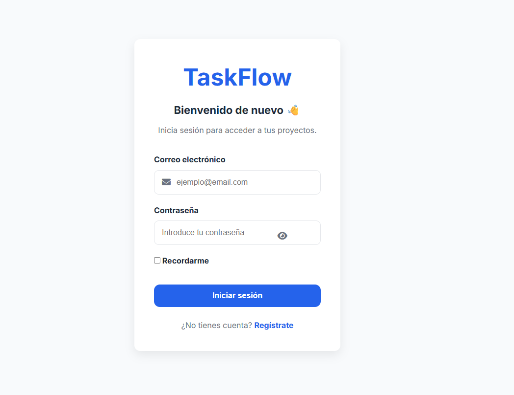
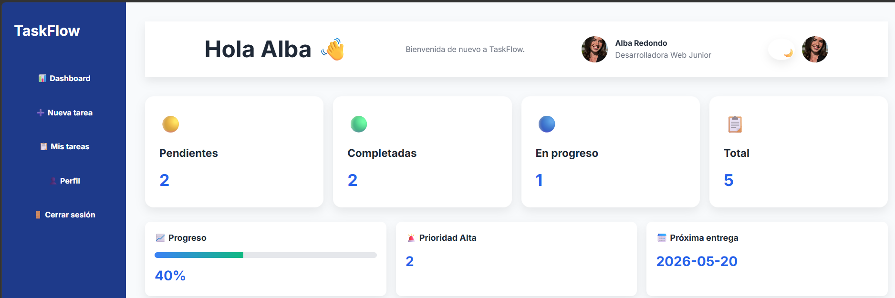
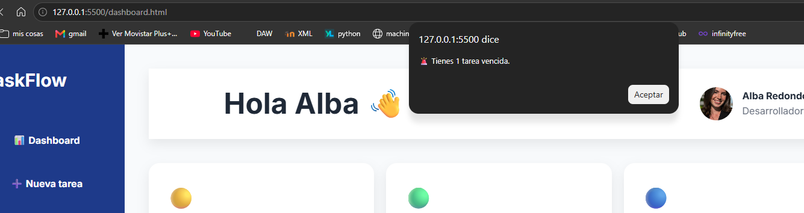
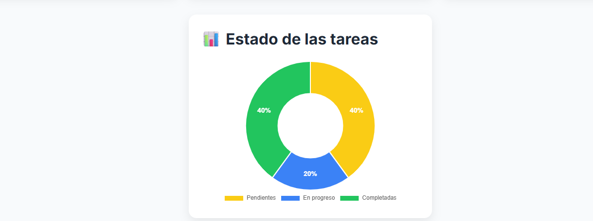
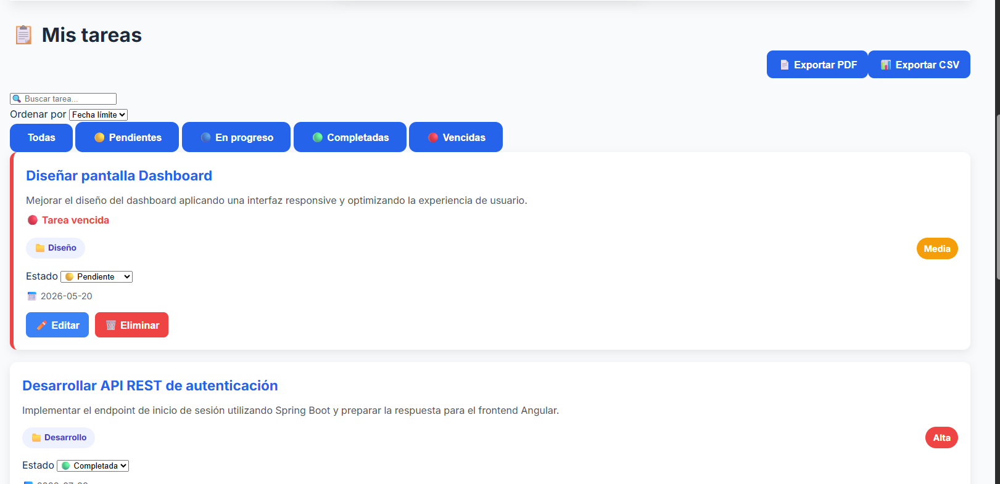
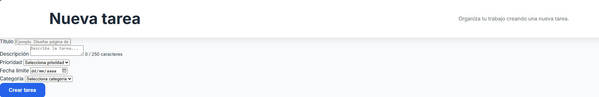

# 🚀 TaskFlow

> Aplicación web de gestión de tareas desarrollada con HTML, CSS y JavaScript puro.

TaskFlow es una aplicación orientada a la organización de tareas personales mediante un sistema de gestión sencillo, moderno e intuitivo. El proyecto ha sido desarrollado sin frameworks, utilizando únicamente tecnologías nativas del navegador para reforzar los fundamentos del desarrollo Frontend.

---

## ✨ Características

- ✅ Gestión completa de tareas (CRUD)
- ✅ Crear tareas
- ✅ Editar tareas
- ✅ Eliminar tareas
- ✅ Estados de tarea
  - Pendiente
  - En progreso
  - Completada
- ✅ Prioridades
  - Alta
  - Media
  - Baja
- ✅ Categorías
- ✅ Fecha límite
- ✅ Buscador de tareas
- ✅ Ordenación por:
  - Fecha
  - Prioridad
  - Nombre
- ✅ Filtros por estado
- ✅ Detección de tareas vencidas
- ✅ Resumen del proyecto
- ✅ Estadísticas
- ✅ Barra de progreso
- ✅ Exportación a CSV
- ✅ Exportación a PDF
- ✅ Notificaciones
- ✅ Modo oscuro
- ✅ Diseño Responsive
- ✅ Persistencia mediante LocalStorage

---

# 📷 Capturas

> Añadir aquí imágenes del proyecto.

## index
 //SI LE DAS A LOGIN TE LLEVA A login.html//

## login

 //SI METES USUARIO Y CONTRASEÑA TE LLEVA A dashboard.html y si tienes alguna tarea vencida te salta la notificación//

## Dashboard

![Dashboard]






## Nueva tarea



# 🛠 Tecnologías utilizadas

- HTML5
- CSS3
- JavaScript (ES6+)
- LocalStorage
- Chart.js
- jsPDF

---

# 📁 Estructura del proyecto

```text
TaskFlow
│
├── css
│   ├── dashboard.css
│   ├── login.css
│   ├── responsive.css
│   ├── style.css
│   ├── toast.css
│   └── variables.css
│
├── img
│
├── js
│   │
│   ├── dashboard
│   │   ├── charts.js
│   │   ├── dashboard.js
│   │   ├── export.js
│   │   ├── filters.js
│   │   ├── notifications.js
│   │   ├── search.js
│   │   ├── sorting.js
│   │   ├── stats.js
│   │   ├── summary.js
│   │   ├── taskCard.js
│   │   ├── taskEvents.js
│   │   └── taskFilters.js
│   │
│   ├── tasks
│   │   ├── taskCounter.js
│   │   ├── taskDelete.js
│   │   ├── taskEdit.js
│   │   ├── taskForm.js
│   │   └── taskStatus.js
│   │
│   ├── models
│   │   └── task.js
│   │
│   ├── app.js
│   ├── login.js
│   ├── storage.js
│   ├── theme.js
│   └── toast.js
│
├── dashboard.html
├── index.html
├── login.html
├── nueva-tarea.html
└── perfil.html
```

---

# 🚀 Funcionalidades

## Gestión de tareas

- Crear nuevas tareas.
- Editar tareas existentes.
- Eliminar tareas.
- Cambio de estado dinámico.

---

## Dashboard

El panel principal muestra información resumida del proyecto:

- Número total de tareas.
- Tareas pendientes.
- Tareas en progreso.
- Tareas completadas.
- Porcentaje de progreso.
- Próxima fecha de entrega.
- Número de tareas de prioridad alta.

---

## Organización

Las tareas pueden organizarse mediante:

- búsqueda en tiempo real;
- filtros por estado;
- ordenación por fecha, prioridad o título.

---

## Exportación

Permite exportar toda la información del proyecto a:

- 📄 PDF
- 📊 CSV

---

## Responsive Design

La aplicación adapta automáticamente la interfaz para:

- Ordenador
- Tablet
- Móvil

---

## Persistencia de datos

Toda la información se almacena mediante **LocalStorage**, permitiendo mantener las tareas entre sesiones del navegador.

---

# ▶️ Instalación

Clonar el repositorio

```bash
git clone https://github.com/TU-USUARIO/taskflow.git
```

Entrar en la carpeta

```bash
cd taskflow
```

Abrir

```text
index.html
```

o ejecutar mediante un servidor local (Live Server, XAMPP, etc.).

---

# 📌 Mejoras futuras

- Backend con Node.js
- API REST
- Base de datos MySQL
- Sistema de autenticación JWT
- Usuarios
- Sincronización entre dispositivos
- Notificaciones Push
- Calendario de tareas

---

# 👨‍💻 Autor

Desarrollado por ALBA REDONDO ARDID

GitHub:

https://github.com/15albaredondo-hue

---

# 📄 Licencia

Proyecto desarrollado con fines educativos y de aprendizaje.